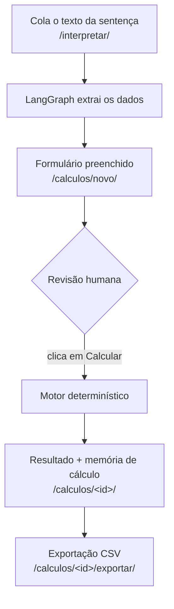

# Juriscalc

**Plataforma de cálculos jurídicos com motor determinístico e interpretação de sentenças por LLM.**


> Módulo inicial: **Atualização e Correção Monetária**

---

## Sumário

- [O problema](#o-problema)
- [O que o Juriscalc entrega](#o-que-o-juriscalc-entrega)
- [Como funciona](#como-funciona)
- [Arquitetura](#arquitetura)
- [Apps Django](#apps-django)
- [Destaque de engenharia](#destaque-de-engenharia)
- [Valor de negócio](#valor-de-negócio)
- [Instalação](#instalação)
- [Uso](#uso)
- [Testes](#testes)
- [Roadmap](#roadmap)

---

## O problema

Cálculos de atualização monetária e juros em processos judiciais ainda são feitos, em boa parte, em planilhas manuais. O profissional transcreve à mão valores e datas de uma sentença, escolhe índices período a período e aplica regras de legislação que mudam a cada Emenda Constitucional.

O resultado: tempo elevado de elaboração, risco de erro de digitação e memórias de cálculo difíceis de auditar.

**Quem sofre com isso:** advogados, contadores judiciais, peritos, assessores e servidores de varas e tribunais.

---

## O que o Juriscalc entrega

| Garantia | Como |
| --- | --- |
| **Cálculo determinístico e auditável** | Toda a aritmética roda no back-end com `Decimal`. Cada etapa gera uma linha de memória de cálculo (período, índice, fator, juros, subtotal). Todo número exibido é explicável. |
| **Legislação parametrizável** | As regras de correção e juros (EC 113/2021, EC 136/2025, faixas históricas) vivem em tabelas de banco, não no código. Mudou a lei, edita-se um registro. |
| **Interpretação de sentença por LLM** | O usuário cola o texto da sentença; um grafo LangGraph extrai os dados e preenche o formulário. O usuário revisa, ajusta e só então dispara o cálculo. |

**Por que importa:** reduz o tempo de elaboração, elimina erros de digitação, garante conformidade com a legislação vigente e produz uma memória de cálculo defensável em juízo.

---

## Como funciona

O **princípio inegociável** do projeto é a **separação estrita entre interpretação (LLM) e cálculo (back-end)**. O grafo LangGraph *somente extrai e estrutura* dados. Ele **nunca** calcula. O cálculo é sempre disparado pelo usuário, após revisão humana, e processado pelo motor determinístico.



> Não existe rota que dispare cálculo automaticamente a partir da interpretação por LLM. O cálculo só ocorre por ação explícita do usuário, após revisão.

---

## Arquitetura

| Camada | Escolha | Por quê | Alternativa | Impacto |
| --- | --- | --- | --- | --- |
| **Front-end** | Templates Django + design system próprio (`design-system.html`) | Renderização server-side mantém o fluxo simples, com revisão humana e zero build de SPA; o design system centraliza tokens | SPA React/Vue | Time-to-market, consistência visual, menos superfície de bug |
| **Back-end** | Python + Django 6 (Class Based Views) | O cálculo precisa ser determinístico e auditável; Django entrega auth, ORM, migrações e admin nativos | Flask/FastAPI puro | Produtividade, ORM para a tabela de vigências, admin grátis |
| **Banco de dados** | SQLite (padrão do Django) | A carga do módulo inicial é monousuário e cabe em SQLite | PostgreSQL | Zero infra; migração futura trivial via ORM |
| **Índices econômicos** | API do IBGE (INPC, IPCA-E) + API do BCB/SGS (SELIC, IGP-M) | Fontes oficiais e gratuitas; clientes isolados em `indices.services` com cache local persistente | Provedores pagos | Resiliência: API indisponível não quebra cálculo já em cache |
| **IA / Interpretação** | LangChain + LangGraph (provedor de LLM via env var) | Grafo de nós explícito com provedor abstraído; nenhum provedor hardcoded | Chamada direta a uma API de LLM | Flexibilidade de provedor, fronteira arquitetural clara |
| **Precisão monetária** | `Decimal` + `ROUND_HALF_EVEN` | Valores monetários nunca usam `float`; arredondamento bancário e quantização final a 2 casas | `float` | Precisão e reprodutibilidade exata |

**Grafo de interpretação:** `ingest → extract → validate → map_to_form → finalize`

---

## Apps Django

| App | Responsabilidade |
| --- | --- |
| `core` | Base abstrata `TimeStampedModel` (`created_at` / `updated_at`), settings e configuração compartilhada |
| `accounts` | Autenticação e painel sobre `django.contrib.auth` (login, cadastro, dashboard) |
| `indices` | Modelos, clientes de API (IBGE / BCB) e cache local dos índices econômicos |
| `legislation` | Tabela de vigências parametrizável: regras de correção, juros e unificação por período |
| `calculations` | Motor de cálculo determinístico, parcelas, memória de cálculo e exportação |
| `interpreter` | Grafo LangGraph de interpretação de sentenças. **Nunca** importa o motor de cálculo |

---

## Destaque de engenharia

O ponto mais delicado é o **motor de cálculo determinístico** (`calculations/services.py`), que precisa:

1. Resolver qual regra de correção / juros vale em cada subintervalo, a partir da tabela de vigências.
2. Respeitar a **não cumulação** de correção e juros a partir de 09/12/2021 (a SELIC unifica os dois).
3. Aplicar o **ponto de corte de RPV / Precatório**, que substitui a correção por *IPCA + 2% a.a. limitado à SELIC* a partir da data de emissão, sobrepondo-se à regra que a tabela aplicaria no período.

```python
# calculations/services.py - divide os segmentos no ponto de emissão do RPV/Precatório.
# Antes da emissão: vale a regra da tabela de vigências.
# A partir da emissão (inclusive): correção vira ipca_plus_capped e os juros
# passam a ser unificados (não cumulação preservada nos dois trechos).
def _segments_with_rpv(self, legislation_segments, data):
    """Split segments at rpv_issue_date, overriding correction after cut."""
    rpv_date = data['rpv_issue_date']
    # ...
    after_seg['start_date'] = rpv_date
    after_seg['mode'] = 'ipca_plus_capped'   # IPCA + 2% a.a., teto SELIC
    after_seg['is_unified'] = True            # bloqueia dupla incidência
    after_seg['interest_mode'] = 'ipca_plus_capped'
```

**Garantias do motor:**

- Uso exclusivo de `Decimal` com `ROUND_HALF_EVEN`.
- Valores intermediários a 8 casas; total quantizado a 2 casas.
- **Idempotência**: mesma entrada produz a mesma saída.
- **Nenhum import** da app `interpreter`.
- Cada operação gera um `CalculationStep` persistido, a memória de cálculo auditável.

---

## Valor de negócio

- **Para o profissional:** elimina a transcrição manual e produz memória de cálculo defensável, com cada fator rastreável ao índice oficial e à base legal.
- **Para conformidade:** as transições de EC (113/2021, 136/2025) e as faixas históricas vivem em dados editáveis. Adaptar-se a uma nova lei é alterar registros, não reescrever o motor.
- **Para o produto:** a arquitetura modular (uma app por família de cálculo) e a fronteira LLM × cálculo permitem adicionar módulos sem tocar no núcleo determinístico e trocar o provedor de LLM por variável de ambiente.

---

## Instalação

**Requisitos:** Python 3.12+ (desenvolvido em 3.13).

```bash
# 1. Entre no diretório do projeto
cd juriscalc

# 2. Crie o ambiente virtual e instale as dependências
python -m venv .venv
source .venv/bin/activate          # Windows: .venv\Scripts\activate
pip install -r requirements.txt

# 3. (Opcional) Configure variáveis de ambiente
#    A interpretação por LLM exige um provedor configurado:
export LLM_PROVIDER=...            # ex.: openai, anthropic
export LLM_API_KEY=...
export LLM_MODEL=...
#    Em produção, defina também:
export DJANGO_DEBUG=0
export DJANGO_SECRET_KEY=...
export DJANGO_ALLOWED_HOSTS=seu-host

# 4. Aplique as migrações (carregam a tabela de vigências e os tipos de índice)
python manage.py migrate

# 5. (Opcional) Pré-aqueça o cache de índices a partir das APIs públicas
python manage.py seed_index_values

# 6. Crie um usuário e suba o servidor
python manage.py createsuperuser
python manage.py runserver
```

---

## Uso

| Etapa | Rota | O que fazer |
| --- | --- | --- |
| **Acesso** | `http://localhost:8000/` | Redireciona para o painel; faça login ou cadastre-se. |
| **Importar sentença** | `/interpretar/importar/` | Cole o texto e clique em "Interpretar" para preencher o formulário via LLM. |
| **Novo cálculo** | `/calculos/novo/` | Informe valor base, termos inicial / final, modo de índice (manual / automático), juros, honorários e parcelas. Se for o caso, marque "RPV/Precatório emitido" com a data de emissão. Revise e clique em **Calcular**. |
| **Resultado** | `/calculos/<id>/` | Veja o total atualizado e a memória de cálculo. |
| **Exportar** | `/calculos/<id>/exportar/` | Baixe o CSV (UTF-8 com BOM). |

---

## Testes

```bash
python manage.py test
```

Suíte com cerca de **145 testes** cobrindo cálculo determinístico, transições de legislação, clientes de índice (com HTTP mockado), interpretação por LLM (mockada) e a separação arquitetural LLM × cálculo.

---

## Roadmap

- [ ] **Novos módulos de cálculo**: trabalhista, contratual e liquidação de sentença complexa, reaproveitando o núcleo determinístico.
- [ ] **Persistência mais robusta**: migração de SQLite para PostgreSQL ao introduzir multiusuário / multitenancy com isolamento de dados.
- [ ] **Exportação ampliada**: PDF da memória de cálculo além do CSV atual.
- [ ] **Integrações**: PJe / e-SAJ, geração de petições e assinatura digital.
- [ ] **Observabilidade**: métricas de uso, monitoração das APIs públicas de índices e alertas de indisponibilidade.
